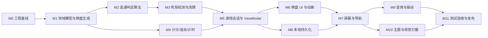

# 开发计划

## 连连看游戏（Android）

| 项目 | 内容 |
|---|---|
| 文档名称 | 连连看游戏开发计划 |
| 文档版本 | V1.1 |
| 编制日期 | 2026-09-12 |
| 依据文档 | 《软件需求规格说明书》V1.1（`doc/软件需求规格说明书.md`） |
| 目标平台 | Android（手机竖屏，API 24+） |
| 项目类型 | 个人作品 / 作品集 |
| 排期单位 | 人日（1 人日 ≈ 6 小时有效开发时间），按依赖顺序编排，不含日历日期 |

### 修订历史

| 版本 | 日期 | 说明 |
|---|---|---|
| V1.0 | 2026-09-12 | 依据 SRS V1.1 编制，含 12 个里程碑与 4 项待澄清问题 |
| V1.1 | 2026-09-12 | 固化 P-1、P-4 两项决策（见 9.1 节 D-1、D-2）；P-2、P-3 保留为按建议执行 |
| V1.2 | 2026-09-12 | 同步 SRS V1.2：第 4 关棋盘规格 6×10 → 8×8（见 9.1 节 D-3）；「图案相同但不可连通」改为保留第一张牌的选中态（见 D-4）；记录 M1~M5 实施结果 |

---

## 1. 计划说明

### 1.1 目的

把 SRS 中的 14 组功能需求（FR-1 ~ FR-14）、7 组非功能需求（NFR-1 ~ NFR-7）和 20 条验收标准（AC-01 ~ AC-20）拆解为**可独立交付、可独立验证**的里程碑，明确每个里程碑的任务、产出物、对应需求与完成判据。

### 1.2 编排原则

1. **算法先行**：连通判定是全局风险最高的部分，且 SRS 要求其为可在 JVM 上单测的纯逻辑（FR-5.7 / NFR-3.1）。因此领域层（M1 ~ M5）全部先于 UI 层（M6 ~ M7）完成，做到「UI 之前，逻辑已绿」。
2. **纯 Kotlin 领域层**：`domain/` 包不得 import 任何 `android.*`，所有游戏规则在此层闭环，用 JUnit 直接测试，不依赖模拟器。
3. **每个里程碑以绿色测试收尾**：`./gradlew :app:testDebugUnitTest` 必须通过，且不引入新的编译告警。
4. **P2 需求不进入关键路径**：皮肤切换、首次引导、无障碍优化等按 SRS 2.7 归入尾声或延后（见第 10 节）。
5. **风险前置**：M0 先做技术验证（Compose 能否在当前 AGP 9 基线跑通），避免在 UI 阶段才发现构建配置问题。

### 1.3 关键路径与并行机会



- **关键路径**：M0 → M1 → M2 → M3 → M5 → M6 → M7 → M11
- **可并行**：M4（计分/计时）可与 M2/M3 并行；M8（持久化）可与 M6 并行；M9 与 M10 可互换顺序。

---

## 2. 技术基线

### 2.1 现状（脚手架已就绪）

| 项 | 当前值 | 位置 |
|---|---|---|
| AGP | 9.3.0 | `gradle/libs.versions.toml` |
| Gradle Wrapper | 9.5.0 | `gradle/wrapper/gradle-wrapper.properties` |
| Kotlin | 由 AGP 9 **内置 Kotlin 支持**提供，无需单独 `kotlin-android` 插件 | — |
| compileSdk / targetSdk | 37 | `app/build.gradle.kts` |
| minSdk | 24 | 同上 |
| Java 兼容级别 | 11 | 同上 |
| 现有依赖 | `core-ktx 1.10.1`、`appcompat 1.6.1`、`material 1.10.0`、`junit 4.13.2`、`espresso 3.5.1`、`androidx.test.ext:junit 1.1.5` | `gradle/libs.versions.toml` |
| R8 keep 规则目录 | `app/src/main/keepRules/rules.keep` | AGP 9 新约定 |
| Kotlin 源码 | **无**（仅两个模板测试文件） | `app/src/` |
| Compose | **未启用** | — |
| ViewModel / DataStore | **未引入** | — |

> 注意：SRS 2.5 要求 UI 采用 **Jetpack Compose + Material 3**，但当前脚手架是 View 体系（`appcompat` + `material`）的模板。M0 的首要任务就是把基线切换到 Compose。

### 2.2 目标基线（M0 完成时）

`gradle/libs.versions.toml` 需补齐以下条目（具体版本号在 M0 当天取各自最新稳定版并回填，避免现在写死过期版本）：

| 类别 | 依赖 | 用途 |
|---|---|---|
| Compose | `androidx.compose:compose-bom` | 统一 Compose 版本 |
| Compose | `androidx.compose.ui:ui`、`ui-graphics`、`ui-tooling-preview` | UI 与 Canvas |
| Compose | `androidx.compose.material3:material3` | Material 3 组件与配色（FR-13.1） |
| Compose | `androidx.activity:activity-compose` | `setContent` 入口 |
| Compose | `androidx.lifecycle:lifecycle-viewmodel-compose` | `viewModel()` 获取 VM |
| Compose | `androidx.navigation:navigation-compose` | 屏幕导航（M7） |
| Compose | `androidx.compose.ui:ui-tooling`(debug)、`ui-test-junit4`(androidTest) | 预览与 UI 测试 |
| 生命周期 | `androidx.lifecycle:lifecycle-runtime-compose` | `collectAsStateWithLifecycle` |
| 数据 | `androidx.datastore:datastore-preferences` | FR-14.1 |
| 协程 | `org.jetbrains.kotlinx:kotlinx-coroutines-android` | 计时与异步 |
| 测试 | `org.jetbrains.kotlinx:kotlinx-coroutines-test` | 计时逻辑单测 |

**待决事项（已确认）**：`appcompat` 与 `material`（View 版）在切换到 Compose 后即无用武之地，**已确认在 M0 中一并移除**（决策 D-2，见 9.1 节）。`MainActivity` 改为继承 `ComponentActivity`，主题改为 `Theme.Material3.*` 系列（现阶段 `themes.xml` 仍继承 AppCompat 主题，需同步调整）。

---

## 3. 里程碑总览

| 里程碑 | 名称 | 人日 | 主要需求 | 关键产出 |
|---|---|---|---|---|
| M0 | 工程基线与技术验证 | 0.5 – 1 | NFR-3.1、SRS 2.5 | 可运行 Compose 空壳、依赖清单定稿 |
| M1 | 领域模型与棋盘生成 | 1 – 1.5 | FR-3.1 – 3.3、DR | `BoardGenerator`、`LevelCatalog`（10 关） |
| M2 | 连通判定算法 | 1.5 – 2 | FR-5、BR-01 – 03 | `PathFinder` + 完整路径输出 |
| M3 | 死局检测与洗牌 | 0.5 – 1 | FR-6、FR-3.4 | `DeadlockDetector`、`ShuffleService` |
| M4 | 计分 / 连击 / 计时 | 0.5 – 1 | FR-7、FR-8 | `ScoreEngine`、`GameTimer` |
| M5 | 游戏会话与 ViewModel | 1 – 1.5 | FR-4、FR-10、3.4 | `GameSession`、`GameViewModel` |
| M6 | 棋盘 UI 与动画 | 2 – 3 | FR-4.6/4.7、FR-13.3 – 13.8 | 棋盘、牌面、连线、消除动画 |
| M7 | 屏幕与导航 | 1.5 – 2 | FR-1、FR-2、FR-10、FR-11 | 主菜单、关卡选择、设置、弹窗 |
| M8 | 本地持久化 | 1 | FR-14、FR-1.2、FR-2.4 | DataStore 仓库层 |
| M9 | 音效与振动 | 1 | FR-12、NFR-6.1 | `SoundPlayer`、`VibratorPlayer` |
| M10 | 主题与视觉打磨 | 1 | FR-13.1/13.2/13.7/13.8 | Material 3 双主题、图案集 |
| M11 | 测试、验收与发布 | 1.5 – 2 | AC-01 – AC-20 | 签名 APK、README |
| | **合计** | **13.5 – 17.5** | | |

---

## 4. 里程碑详细任务

### M0 工程基线与技术验证（0.5 – 1 人日）

**目标**：把 View 体系脚手架切换为 Compose 基线，并证明构建链路可用。

- [x] M0-1 在 `libs.versions.toml` 补齐第 2.2 节所列依赖（版本取最新稳定版）
- [x] M0-2 启用 Compose。**注意 AGP 9 采用内置 Kotlin 支持**（不再显式应用 `org.jetbrains.kotlin.android`），Compose 编译器的启用方式需在本任务中实测确认；若 `android.buildFeatures.compose = true` 单独不够，则补充 Compose 编译器插件（参考 [AGP 9 内置 Kotlin 迁移说明](https://github.com/android/skills/blob/392fd3bc/build/agp/agp-9-upgrade/references/android/build/migrate-to-built-in-kotlin.md)、[Compose 编译器迁移指南](https://kotlinlang.org/docs/compose-compiler-migration-guide.html)）
- [x] M0-3 `MainActivity` 改为 `ComponentActivity` + `setContent`，渲染一句占位文本
- [x] M0-4 移除 `appcompat` / `material`(Views) 依赖，`themes.xml` 与 `values-night/themes.xml` 改用 Material 3 主题（已确认，见 D-2）
- [x] M0-5 在 `AndroidManifest.xml` 的 `<application>` 内声明 `MainActivity`，并锁定竖屏（FR-1.4）
- [x] M0-6 建立第 5 节的包结构骨架（空目录 + `package` 声明）
- [x] M0-7 跑通 `./gradlew :app:assembleDebug` 与 `./gradlew :app:testDebugUnitTest`

**验证**：模拟器/真机上启动 App 显示占位页；两个 Gradle 任务均为 BUILD SUCCESSFUL。

**风险**：若 Compose 在当前 AGP 9 基线下受阻，回退方案是显式引入 Kotlin 插件与 Compose 编译器插件；此决策必须在 M0 内收敛，不得带入 M6。

#### M0 实施记录（2026-09-12）

**R-3 已兑现**：`android.buildFeatures.compose = true` 单独不足以启用 Compose，AGP 会直接报错
`Starting in Kotlin 2.0, the Compose Compiler Gradle plugin is required when compose is enabled`。
解决方案是在 `app/build.gradle.kts` 应用 `org.jetbrains.kotlin.plugin.compose` 插件，版本必须与 AGP 9.3.0 内置的 Kotlin 版本一致 —— 经查 AGP 9.3.0 的 POM，其依赖 `org.jetbrains.kotlin:kotlin-gradle-plugin:2.2.10`，故 `libs.versions.toml` 中锁定 `kotlin = "2.2.10"`。**升级 AGP 时须同步核对此版本**。

**本机构建环境注意事项**：项目 `gradle/gradle-daemon-jvm.properties` 要求 `toolchainVersion=25`，Gradle 默认经 foojay 自动下载，而该下载最终指向 GitHub release 资源，在本机网络下超时（`api.foojay.io` 与 `github.com` 本身可达，仅 release 资产下载失败）。处置方式是在**用户级** `~/.gradle/gradle.properties`（不进仓库，保持项目可移植）中指向 Android Studio 自带的 JBR，其版本恰为 25.0.2：

```properties
org.gradle.java.installations.paths=D:/Program Files/Android/Android Studio/jbr
org.gradle.java.installations.auto-download=false
```

**实施中偏离计划之处**：计划要求 `themes.xml` 改用 Material 3 主题；实际改为平台主题 `android:Theme.Material.Light.NoActionBar`（深色为 `android:Theme.Material.NoActionBar`）。原因是 `Theme.Material3.*` 由 Material Components（Views）库提供，与 D-2「移除 `material` 依赖」冲突；平台主题只影响窗口外观，界面配色完全由 Compose 的 `MaterialTheme` 负责，与官方 Compose 模板一致。同时删除了失去引用的 `values/colors.xml`。

---

### M1 领域模型与棋盘生成（1 – 1.5 人日）

**目标**：纯 Kotlin 领域模型落地，棋盘可按关卡配置随机生成且满足可完全消除的数学前提。

- [x] M1-1 模型：`Position(row, col)`、`Tile(id, type, row, col, state)`、`Board(rows, cols, tiles)`、`GamePhase`、`Settings`、`Progress`（对应 SRS 7.1）
- [x] M1-2 `LevelConfig(level, cols, rows, typeCount, timeLimit, hintCount, shuffleCount)`
- [x] M1-3 `LevelCatalog`：按 SRS 附录 9.3 录入 10 关配置
- [x] M1-4 **图案张数分配器**：按已确认决策 D-1（见 9.1 节）实现——`base = (tileCount / typeCount)` 向下取到最近偶数，前 `k` 类各分得 `base + 2` 张，其余各类分得 `base` 张，`k = (tileCount - base × typeCount) / 2`。已用脚本对 10 关全部验证：`k` 均为非负整数，每类张数为偶数，总和等于牌总数
- [x] M1-5 `BoardGenerator`：构造成对图案集合 → 洗牌 → 填充（FR-3.2），保证同一关多次生成布局不同（FR-3.3）
- [x] M1-6 单测：牌总数为偶数、每类张数为偶数、类型分布符合预期、生成结果随机性（AC-01）

**验证**：`BoardGeneratorTest` 覆盖 10 关配置各生成 100 次，断言 AC-01 三条通过标准。

#### M1 实施记录（2026-09-12）

**产出**：`domain/model/`（Position、Tile、Board、GamePhase、Settings、Progress）、`domain/config/`（LevelConfig、LevelCatalog）、`domain/board/`（TileTypeDistributor、BoardGenerator）。

**单测**：39 个测试全绿 —— `TileTypeDistributorTest`(6)、`BoardGeneratorTest`(7)、`LevelCatalogTest`(7)、`BoardTest`(13)、`ProgressTest`(5)、模板 `ExampleUnitTest`(1)。`app/src/main/java/.../domain/` 下无任何 `android.*` / `androidx.*` 导入，满足 NFR-3.1 与 DoD 第 4 条。

**关键设计决定**：
1. `Board` 采用**不可变扁平存储**（`List<Tile?>` 按行优先），`equals`/`hashCode` 具备值语义，便于测试断言与 M5 的状态比对。生成时按坐标落位，故不存在「Tile 的 row/col 与存放位置不一致」的中间态。
2. `Position` 用 `Int` 而非无符号类型，因为 M2 会产生 `-1` / `== rows|cols` 的绕行坐标。
3. `Board.isPassable(row, col)` 对**越界坐标返回 true**，把 SRS FR-3.5 的「外侧虚拟空白区」直接表达为模型能力，M2 无需真的构造 `(rows+2) × (cols+2)` 的扩展棋盘即可统一处理绕行。
4. `BoardGenerator` 注入 `Random`，测试用固定种子保证可复现（NFR-2.1）。
5. `LevelConfig` 的 `init` 前置校验了「牌总数为偶数」与「每类至少 2 张」，把 D-1 规则的前提固化成配置层契约。

**SRS 观察项（已解决 → 见 9.1 节 D-3）**：录入 SRS 9.3 时发现牌总数序列在第 3→4 关回落（`48, 48, 64, **60**, 64, ...`），当时按原表实现并把该非单调点用断言显式标注。后经确认，9.3 表的设计规律是「每 2–3 关共用一档棋盘规格」，唯独第 4 关（6×10）脱离规律，遂于 SRS V1.2 将其改为 8×8。对应的「标注非单调点」用例已删除，替换为 `牌总数随关卡单调不减` 与 `棋盘规格按 2 至 3 关一组递增` 两条断言。

---

### M2 连通判定算法（1.5 – 2 人日）—— 全局最高风险项

**目标**：实现 FR-5 全部要求，并输出可驱动 UI 绘制的完整路径点序列。

- [x] M2-1 棋盘扩展为 `(rows+2) × (cols+2)`，外圈视为永久空白，统一处理绕行（SRS 9.1）
- [x] M2-2 `PathFinder.find(a, b): PathResult?`，`PathResult` 含 `points: List<Position>` 与 `turns: Int`
- [x] M2-3 0 拐点：同行/同列且中间全空（FR-5.2）
- [x] M2-4 1 拐点：候选拐点 `(a.row, b.col)`、`(b.row, a.col)` 双向可达性检查（FR-5.3）
- [x] M2-5 2 拐点：沿 a 的行/列扫描可直达空白点，再以 0/1 拐点条件桥接到 b（FR-5.4）
- [x] M2-6 非法输入（越界、同一张牌、已消除）安全返回 `null`，不抛异常（NFR-2.4）
- [x] M2-7 单测矩阵：

| 用例 | 断言 | 关联 |
|---|---|---|
| 同行相邻 / 隔空格 / 中间有牌 | 前两者通、后者不通 | AC-02、AC-05 |
| 同列同理 | 同上 | AC-02、AC-05 |
| L 形两个候选拐点分别可用 | 均通且拐点数 = 1 | AC-03 |
| Z 形 / U 形 | 通且拐点数 = 2 | AC-04 |
| 贴边两牌 | 通过外圈绕行连通 | FR-5.5 |
| 棋盘四角两两 | 均可连通 | AC-04 |
| 需 3 个拐点才可达 | 判定不通 | BR-01 |
| 路径点序列 | 首点为 a、末点为 b、相邻点共线、拐点数与 `turns` 一致 | FR-5.6 |

**验证**：`PathFinderTest` 全绿，且测试用例数与断言数在提交信息中体现覆盖率意图。

#### M2 实施记录（2026-09-12）

**产出**：`domain/path/PathResult.kt`、`domain/path/PathFinder.kt`，以及测试工具 `app/src/test/.../domain/TestBoards.kt`。

**单测**：`PathFinderTest` 22 个用例全绿，仓库合计 61 个测试通过。

**与计划的两处偏离（均为改进，非降级）**：

1. **M2-1 未真的构造扩展棋盘**。计划写的是「棋盘扩展为 `(rows+2) × (cols+2)`」。实现改为把外圈表达为**坐标范围** `row ∈ -1..rows`、`col ∈ -1..cols`：落在棋盘外但在这一圈内的格子在 `Board.isPassable` 中恒为可通行，超出这一圈则不可达。效果与扩展棋盘等价（一圈宽度足以表达「绕行 + 至多 2 拐点」的全部路径），但省掉了一份棋盘表示与其同步成本，M2 也不必修改 M1 的 `Board`。
2. **M2-5 的桥接改为「两段垂直扫描」**。计划写的是「再以 0/1 拐点条件桥接到 b」。实现利用了 2 拐点路径的几何性质 —— 首段与末段必然平行、中间段与二者垂直 —— 于是枚举为「A 沿行/列取可达空格 X → X 沿垂直方向取可达空格 Y → 检查 Y 与 B 直线可达」，比递归套用 0/1 拐点判定更直接。

**关键设计决定**：

- **`PathFinder` 只做几何连通，不检查图案类型**。SRS FR-5.1 的「同类型牌」是调用方前置条件：M5 的 `GameSession` 先比类型再调用，M3 的 `DeadlockDetector` 先按类型分组。这样类型规则只存在一处。已用 `本类只做几何连通 - 图案类型是否相同由调用方判断` 用例把这一契约显式固定。
- **候选顺序固定为 0 → 1 → 2 拐点**，因此返回的必然是拐点数最少的路径；`normalize` 会剔除共线中间点，保证 `turns == points.size - 2` 恒成立（FR-5.6）。
- **路径结构不变量用随机棋盘全量扫描验证**：在 3 个关卡配置各 3 副真实棋盘上，对全部同类型牌对判定连通性，逐条校验「首末点正确、相邻点共线且不重合、拐点可通行、每一段中间无牌」。这比逐个手写用例更能兜住边界。

**测试中发现并修正的问题**：初版有一个用例把 `"A.A"` 当作「被阻挡」的棋盘，实际中间是空格，测试如实报出 `turns` 为 0 而非预期的 2 —— 属于用例设计错误而非实现缺陷；已改为 `"A.A"`（直线对照）与 `"ABA"`（阻挡对照）的成对断言，并把「阻挡使 0 拐点变为 2 拐点绕行」这一行为显式固定下来。

---

### M3 死局检测与洗牌（0.5 – 1 人日）

- [x] M3-1 `DeadlockDetector.hasMove(board): Boolean` —— 遍历剩余牌，按类型分组，组内两两试连通（FR-6.1）
- [x] M3-2 `ShuffleService.shuffle(board)` —— 收集剩余牌的类型集合 → 重排 → 校验可解（FR-3.4）
- [x] M3-3 有限次重试（默认 50 次）后仍不可解，回退到「成对重排」策略。**注意需避免无限循环**
- [x] M3-4 洗牌只重排**未消除**的位置，牌数与类型分布保持不变
- [x] M3-5 单测：人为构造死局棋盘 → 断言检测为死局；洗牌后断言存在可连通对；连续洗牌 200 次断言恒可解（AC-08）

**设计提示**：M2 的 `PathFinder` 会被 M3 大量调用，性能上对 8×12 规模可忽略（SRS 9.1 已说明），无需提前优化。

#### M3 实施记录（2026-09-12）

**产出**：`domain/board/Move.kt`、`domain/board/DeadlockDetector.kt`、`domain/board/ShuffleService.kt`。

**单测**：`DeadlockDetectorTest` 9 个 + `ShuffleServiceTest` 11 个，仓库合计 81 个测试全绿。

**兜底策略的正确性证明**（这是 M3-3「避免无限循环」之外真正的难点 —— 计划只要求「回退到成对重排」，但没说明怎么保证一定有解）。设 `S` 为未消除牌所在格子的集合，因为不属于 `S` 的格子必然为空，可以构造性地证明：只要 `|S| ≥ 2`，**总能**摆出一个存在可行步的局面。

1. 若某一行含 ≥2 个 `S` 格子，取其中列号相邻的两个 `p`、`q`：二者之间没有 `S` 格子（即全空），`p → q` 直线畅通，**0 拐点**可连通。
2. 同列同理。
3. 否则每一行、每一列至多含 1 个 `S` 格子。任取 `p`、`q`，拐点候选 `c = (p.row, q.col)` 位于 `p` 所在行，而该行唯一的 `S` 格子是 `p`；又因 `q.col ≠ p.col` 故 `c ≠ p`，所以 `c ∉ S` 必为空；两段连线所在的行/列除 `p`、`q` 外亦无 `S` 格子，路径畅通，**1 拐点**可连通。

实现即按此三分支选取 `findGuaranteedConnectablePair`，把某一类图案的两张牌放到这一对格子上，其余牌随意落位 —— 落位不会挡住路径，因为上述路径途经的格子都不在 `S` 中。已用 `maxAttempts = 0`（跳过全部随机尝试、强制走兜底）在 10 个关卡从满盘逐步消到只剩 2 张的**全部 300+ 个中间局面**上逐一验证兜底结果确实有解。

**交叉验证**：`hasMove` 另有一个测试内独立实现的暴力版本（不做分组、不提前返回，直接穷举全部同类型牌对调用 `PathFinder`），在 3 个关卡各 3 轮、逐对消除产生的 300+ 个棋盘状态上比对两者结论完全一致。

**测试中发现并修正的问题**：初版把 `"A.B.A"` 当作「中间是空格」的用例并断言 0 拐点；实际中间有 B 阻挡，`PathFinder` 给出的是绕外侧的 2 拐点路径。拆分为 `"A..A"`（真·空格，0 拐点）与 `"A.B.A"`（被阻挡但可绕行，2 拐点）两个用例，后者同时说明了「被阻挡仍可绕行就不算死局」。

---

### M4 计分 / 连击 / 计时（0.5 – 1 人日）

- [x] M4-1 `ScoreEngine`：单次得分 = `10 × 倍率`，倍率 = `min(1 + 0.1 × (combo - 1), 2.0)`（FR-8.1、SRS 9.2）
- [x] M4-2 连击窗口 3 秒，超时归零；错误选中、洗牌道具均归零；提示道具不归零（FR-8.2/8.3、FR-9.4）
- [x] M4-3 通关时间奖励 = 剩余秒数 × 2（FR-8.4）
- [x] M4-4 `GameTimer`：**注入时间源**（`() -> Long` 或 `Clock`）而非直接读系统时间，便于单测与暂停恢复（SRS 2.6、5.2）
- [x] M4-5 剩余时间 < 30s 的视觉提示状态位（FR-7.4，P2，逻辑层先留 flag）
- [x] M4-6 单测：倍率上限 2.0 的边界、连续 20 次消除的累计得分、暂停期间计时不推进、超时归零

**验证**：`ScoreEngineTest`、`GameTimerTest` 全绿（AC-10、AC-09 的算法部分）。

#### M4 实施记录（2026-09-12）

**产出**：`domain/score/ScoreState.kt`、`domain/score/ScoreEngine.kt`、`domain/score/GameTimer.kt`。

**单测**：`ScoreEngineTest` 16 个 + `GameTimerTest` 16 个，仓库合计 113 个测试全绿。

**关键设计决定**：

1. **计分全程走整数，避开浮点尾差**。SRS 9.2 的倍率 `1 + 0.1 × (n − 1)` 恒为 0.1 的整数倍，因此用「十分之一」为单位的整数精确表示：`multiplierTenths(combo) = min(20, 10 + (combo − 1))`，得分 = `10 × multiplierTenths / 10`。若直接用 `Double`，`10 × 1.1` 这类运算会产生尾差，取整时容易少 1 分。有用例逐一比对 1..200 连击的整数路径与浮点倍率，确认二者始终一致。
2. **领域层完全不持有时间**。`ScoreEngine` 的全部时间入口都由调用方传入 `nowMillis`；`GameTimer` 的时钟通过构造参数注入，默认值是单调时钟 `System.nanoTime() / 1_000_000`（SRS 5.2 要求不受系统时间调整影响）。测试全部注入假时钟，无需 `sleep`，因此完全确定。
3. **`ScoreState` 为不可变数据类**，`ScoreEngine` 是纯函数集合。`onEliminated` 一次性完成「判定窗口 → 更新连击 → 累加得分 → 刷新最高连击」，把 SRS FR-8.2 与 FR-8.3 的「≤ 3 秒续接、超过则从 1 重来」收敛到一处，M5 不必重复这些判断。
4. **`resetCombo` 只清连击、保留得分与最高连击**。SRS FR-8.3 与 FR-9.4 的三个重置触发点（错误选中、间隔超时、使用洗牌）共用它；其中「间隔超时」由 `onEliminated` 内部隐式处理，不劳调用方判断。FR-9.4 特别指出「使用提示不重置连击」，因此提示道具不会调用本方法 —— 这条约束在 M5 落地并由会话级测试覆盖。
5. **低时间告警按严格小于判定**。FR-7.4 的措辞是「低于 30s」，故 `isTimeLow = remainingSeconds() < 30`：恰好剩 30 秒时不算告警，剩 29 秒时才算。有用例把这一边界固定下来。
6. **倒计时向上取整**。`remainingSeconds()` 用 `ceil`，使剩余 178.5 秒显示 179 —— 否则刚开始的 1 毫秒内倒计时就会从 180 跳到 179，观感上像「开局就少了一秒」。

**为 M5 预留的接口**：`ScoreEngine.isComboAlive(state, nowMillis)` 用于 UI 判断连击是否已过期（连击数字应在窗口结束后淡出）；`GameTimer.isTimeLow` 已就绪，M6 的 HUD 直接消费，无需在 UI 层重算阈值。

---

### M5 游戏会话与 ViewModel 编排（1 – 1.5 人日）

**目标**：把 M1 ~ M4 的零件组装成一次「消除事务」，并暴露给 UI。

- [x] M5-1 `GameSession`（纯 Kotlin 聚合根），对外仅暴露 `select(position): SelectResult` 与 `pause/resume/restart/useHint/useShuffle`
- [x] M5-2 消除事务顺序：校验选中 → 判连通 → 移除牌 → 计分/连击 → 死局检测 → 必要时自动洗牌 → 判定通关（FR-4、UC-03 主流程）
- [x] M5-3 错误反馈语义与 SRS 一致：图案不同 → `WrongType`（并把第二张设为选中）；图案相同但不通 → `NoPath`（FR-4.4/4.5）
- [x] M5-4 道具：提示找一对可连通牌并返回坐标，不消耗连击；洗牌消耗次数、清空选中、连击归零；用尽时返回不可用（FR-9.1 – 9.5）
- [x] M5-5 自动洗牌不消耗玩家道具次数，并置「已自动重排」提示位（FR-6.2）
- [x] M5-6 状态机 `READY / PLAYING / PAUSED / WIN / LOSE` 与 SRS 3.4 完全一致；重开/重试不重置解锁进度（FR-10.7）
- [x] M5-7 `GameViewModel`：持有 `StateFlow<GameUiState>`，用 `viewModelScope` 驱动计时；接收 UI 事件
- [x] M5-8 单测：会话级集成测试——模拟完整一局（自动寻解直到清盘）断言 `WIN`；模拟超时断言 `LOSE`；模拟死局断言自动洗牌

#### M5 实施记录（2026-09-12）

**产出**：`domain/session/`（`GameState`、`SessionResults`、`GameSession`）、`ui/game/`（`GameUiState`、`GameViewModel`），以及在 `domain/board/` 新增的 `BoardFactory` 接缝。

**单测**：`GameSessionTest` 21 个，仓库合计 134 个测试全绿。领域层仍无任何 `android.*` / `androidx.*` 导入（仅 `ui/game` 的 ViewModel 依赖 AndroidX，符合分层约定）。

**关键设计决定**：

1. **选中态与提示高亮按 SRS 7.1 存放在 `Tile.state`**（`NORMAL / SELECTED / HINTED`），`GameState` 不另设 `selected` 字段，改由 `selectedPosition` / `hintedPositions` 派生 —— 避免「牌子上的状态」与「会话的状态」两处不同步。
2. **状态与一次性效果分成两条流**。`uiState: StateFlow<GameUiState>` 供 Compose 渲染，`effects: SharedFlow<GameEffect>` 承载 Snackbar 与连线/消除动画。若把动画与提示塞进持久状态，重组时会重复播放，是 Compose 里很常见的一类 bug；分开之后 M6 只要订阅 `effects` 即可。
3. **增加 `BoardFactory` 接缝**。`GameSession` 原本直接持有 `BoardGenerator`，导致「消除后恰好进入死局 → 自动洗牌」这条路径无法用随机棋盘稳定复现。改为注入 `fun interface BoardFactory` 后，测试可以传入手工构造的固定棋盘。这是计划外新增的一层，但换来的是 FR-6.2 从「大概率测不到」变成「必然测到」。
4. **结算数据（`GameResult`）挂在 `GameState` 上**，通关与失败共用同一结构：失败时剩余时间为 0、时间奖励自然为 0，因此 `score` 在两种情况下都等于 SRS 9.2 的「消除得分 + 时间奖励」。消除动作本身只返回 `Eliminated`（含路径，供动画用），是否结算由调用方观察 `state.phase` 决定 —— 这样一次消除既能播动画又能触发结算面板，不会二选一。
5. **`tick()` 显式驱动倒计时**。`GameSession` 不自己起协程，由 `GameViewModel` 每 200ms 调一次 `tick()`；`tick()` 在暂停或已结束时是空操作。好处是领域层仍可在 JVM 上同步地、确定地测出「超时判负」，不必等真实时间。

**SRS 解读项（已解决 → 见 9.1 节 D-4）**：SRS UC-03 步骤 3.b.ii 对「图案相同但不可连通」只说「视为错误操作（**同 3.a 的反馈**）」，而 3.a 的反馈包含「将新点击的牌设为选中」，读起来有歧义。M5 先按字面实现（`NoPath` 与 `WrongType` 行为一致），记录在案后确认改为**保留第一张牌的选中态**，方便玩家直接改选搭档。

SRS 已随之发布 V1.2（UC-03 步骤 3.b.ii 与 FR-4.4 均补充该句），代码侧 `GameSession.select` 的 `NoPath` 分支已改为不改写棋盘、仅重置连击，并新增 `连通失败后可直接改选其他搭档` 用例覆盖完整链路。

**为 M6/M7 预留的接口**：`GameViewModel.onPauseClick/onResumeClick/onRestartClick/onHintClick/onShuffleClick/onTileClick` 已就绪；`GameSession.remainingMillis()` 与 `timerLimitMillis` 可供 HUD 绘制更平滑的倒计时进度环。

---

### M6 棋盘 UI 与动画（2 – 3 人日）

- [x] M6-1 棋盘容器：按 `cols × rows` 等分可用宽高，单元格边长取 `min(可用宽 / cols, 可用高 / rows)`
- [x] M6-2 `TileView`：圆角卡片 + 阴影 + 按压缩放反馈（FR-13.3）；选中态边框光晕/背景高亮（FR-13.4）
- [x] M6-3 牌面图案：emoji / 矢量图标，保证小尺寸下可辨识（FR-13.7）
- [x] M6-4 `PathOverlay`：`Canvas` 绘制连线，支持圆角折线与渐变（FR-13.5）；路径取 M2 输出的点序列
- [x] M6-5 连线动画：沿线快速绘制（约 150 ms）后启动消除动画
- [x] M6-6 消除动画：缩放 + 淡出（FR-13.6），动画期间该牌不可再点（FR-4.7）
- [x] M6-7 错误反馈：两牌抖动 / 红闪
- [x] M6-8 顶部 HUD：倒计时、得分、连击（< 30s 变色）；底部操作条：提示、洗牌、暂停（用尽置灰，FR-9.3）
- [x] M6-9 无障碍最小点击尺寸检查：8 列布局在 360dp 宽屏上单格约 42–45dp，低于 48dp 建议值（SRS 未要求无障碍，记为已知取舍，见第 9 节 P-3）

**验证**：AC-06、AC-07 手动验收；连线动画无卡顿、消除后棋盘无残影。

#### M6 实施记录（2026-09-12）

**产出**：`ui/game/` 新增 `TileFaces`、`TileView`、`BoardView`、`PathOverlay`、`GameHud`（含 `GameActionBar`）、`GameScreen`；`GameEffect` 增加 `Rejected`；`GameViewModel` 增加 `factory`；`MainActivity` 暂时直接承载第 1 关；`strings.xml` 补齐文案。

**单测**：新增 `TileFacesTest`(4) 与 `GameViewModelTest`(6)，仓库合计 146 个测试全绿；APK 12.88 MB 构建成功。

**关键设计决定**：

1. **棋盘区域按 `(cols + 2) × (rows + 2)` 格分配**，棋盘本体居中、外侧留一圈。这样绕棋盘外部的连线（FR-3.5）才有地方可画，且与 `PathOverlay` 的坐标换算（`(col + 1.5) × cell`）天然配套，不必依赖「绘制超出边界」这种容易被父布局裁剪的行为。代价见 9.2 节 P-3。
2. **用 `Box` + 绝对偏移摆牌，而不是 `LazyVerticalGrid`**。棋盘最大 96 格无需懒加载，而连线绘制需要与牌共用的格子坐标系。牌的偏移套 `animateDpAsState`，洗牌时牌会平滑滑动而非瞬间跳位。
3. **消除动画用「残影」补偿已移除的牌**。牌在领域层已被移除，`GameEffect.Eliminated` 携带两张牌的完整快照，UI 据此在原位置渲染 `GhostTile` 做缩放淡出，避免「还没看清就消失」。两段动画：150ms 画连线 + 250ms 缩放淡出。
4. **连线用 `PathMeasure.getSegment` 做生长动画**，并叠一层更粗更透明的同色描边形成外发光；`StrokeJoin.Round` 满足 FR-13.5 的「圆角折线」，颜色用 `Brush.linearGradient` 从第三色渐变到主色。
5. **文案在 composable 内解析，`GameMessage` 保持纯语义枚举**。若把文案做成常量表就得让枚举依赖 Android 资源，因此改为在 `GameScreen` 内用 `stringResource` 构造映射，并通过 `rememberUpdatedState` 让长驻的事件收集器读到最新值、又不会因 map 每次重建而重启收集。
6. **`showSnackbar` 另起协程**。它会挂起到提示消失，若直接放在事件收集器里会阻塞后续效果的消费。
7. **可用性判断一律取自 `GameState`**：道具按钮置灰直接读 `hintLeft` / `shuffleLeft`（FR-9.3），倒计时变色直接读 `isTimeLow`（FR-7.4），UI 不重算阈值。

**测试踩到的坑（值得记一笔）**：`GameViewModelTest` 首次运行导致测试**永久空转** —— 不是卡死而是死循环，Gradle 守护进程烧掉 500+ 秒 CPU。原因是 `GameViewModel` 的心跳是 `while (isActive) { delay(...) }` 常驻循环，与 `runTest` 共用虚拟时间调度器时，`runTest` 为了「等到调度器空闲」会无限推进虚拟时间。修法是把测试的 `Dispatchers.setMain` 指向真实调度器而非测试调度器，并在 `tearDown` 取消 `viewModelScope`。

**验证范围说明**：M6 目前只做到**编译与单测验证**（`assembleDebug` + 146 个单测全绿）。棋盘渲染、连线动画、抖动反馈属于视觉行为，尚无自动化手段覆盖。`cellSizeFor` 已抽成纯函数便于日后单测，但 Compose 层的实际观感需要真机/模拟器手动验收（AC-06、AC-07），留待 M11。

---

### M7 屏幕与导航（1.5 – 2 人日）

- [x] M7-1 导航图：`menu → levelSelect → game`，配 `Navigation Compose`
- [x] M7-2 主菜单（FR-1.1 – 1.3）：标题、开始/继续（有进度显示「继续」）、关卡选择、设置、退出
- [x] M7-3 关卡选择（FR-2.1 – 2.4）：10 关卡片，锁定态、最佳分、解锁联动
- [x] M7-4 暂停弹窗（FR-10.1）：继续 / 重开本关 / 返回主菜单
- [x] M7-5 结算面板（FR-10.2 – 10.6）：得分、最高连击、时间奖励、是否刷新最佳分；通关显示「下一关」（末关显示「全部通关」），失败显示「重试本关」「返回主菜单」
- [x] M7-6 设置页（FR-11.1 – 11.5）：音效、振动、主题模式、皮肤、清除进度（二次确认）
- [x] M7-7 全局反馈：Snackbar 承载「道具用尽」「无法连通」「已自动重排」等提示（SRS 5.1）

#### M7 实施记录（2026-09-12）

**产出**：`ui/nav/AppNavHost.kt`（路由与导航图）、`ui/menu/`、`ui/level/`、`ui/settings/`（各含 ViewModel + Screen）、`ui/dialog/GameDialogs.kt`；`data/` 新增 `SettingsRepository` 与 `ProgressRepository`（接口 + 内存实现）；`MainActivity` 改为导航宿主与最轻量的依赖容器；`strings.xml` 补齐全部界面文案。

**单测**：新增 `RepositoryTest`(8)，仓库合计 154 个测试全绿；APK 12.90 MB 构建成功。

**关键设计决定**：

1. **数据层先定接口、后换实现**。M7 面向 `SettingsRepository` / `ProgressRepository` 接口编程，暂用内存实现；M8 只需替换实现类，界面层零改动。接口里承载的是**真实逻辑**（「是否刷新最佳分」FR-8.5、「解锁下一关」FR-2.4、「清空进度」FR-11.5），换成 DataStore 后不变，因此现在就固化成测试。
2. **屏幕不做导航决策，只接回调**。「进入哪一关」由 `MenuViewModel` 依据进度算出（有进行中进度回该关，否则进首个未通关关卡，全通则回第 1 关 —— FR-1.2），导航图只负责转发。保持 SRS NFR-3.1 的分层意图。
3. **结算与进度记录放在 `GameScreen`**。只有这个屏幕同时知道「哪一关」与「什么结果」，因此由它在 `LaunchedEffect(state.result)` 里调用 `recordCleared` 并把「是否刷新最佳分」留在本地状态供结算面板展示（FR-10.4）。这比让导航层中转 result 再回传 `isNewRecord` 少一个状态回路。
4. **`ThemeMode → 深色` 的判定放在 MainActivity，不放进 `Settings`**。「跟随系统」需要读 Compose 环境（`isSystemInDarkTheme()`），而 `Settings` 属于必须在 JVM 上可单测的纯领域模型（NFR-3.1）。
5. **结算面板是模态的**：`onDismissRequest = {}` 不允许点外部关掉，必须显式选一个动作（FR-10.5 / FR-10.6）。

**M8 的接入点已就绪**：`MainActivity` 里两行 `InMemoryXxxRepository()` 换成 DataStore 实现即可；`progressRepository.setInProgressLevel` 已在进入关卡时被调用（FR-14.3）。

**验证范围**：与 M6 相同，本轮只做到编译与单测。导航跳转、弹窗交互、主题切换属视觉/交互行为，需真机手动验收（AC-12、AC-13、AC-14、AC-15），留待 M11。

---

### M8 本地持久化（1 人日）

- [x] M8-1 `DataStore` 实例与键定义，完整覆盖 SRS 7.2 数据字典 9 个键
- [x] M8-2 `SettingsRepository`（音效/振动/主题/皮肤）、`ProgressRepository`（解锁关卡、各关最佳分、总分、进行中关卡、schema 版本）
- [x] M8-3 写入时机：关卡结束、进度解锁、设置变更（DR-2）
- [x] M8-4 主题模式驱动 Compose `isSystemInDarkTheme()` 分支（配合 M10）
- [x] M8-5 「继续游戏」读取进行中关卡（FR-1.2、FR-14.3，P1）
- [x] M8-6 进行中关卡的快照粒度：按 DR-3 先做「仅保存关卡编号」，若成本可控再升级为完整快照
- [x] M8-7 单测：仓库以 `DataStore` 的测试替身（临时文件）验证读写与默认值

**验证**：AC-13、AC-14 手动验收；杀进程重启后进度与设置保留（NFR-2.3）。

#### M8 实施记录（2026-09-12）

**产出**：`data/DataStoreKeys.kt`、`data/PreferencesMapping.kt`、`data/DataStoreRepositories.kt`、`data/AppDataStore.kt`；`MainActivity` 换成 DataStore 实现的仓库。

**单测**：新增 `PreferencesMappingTest`(10)，仓库合计 164 个测试全绿；APK 构建成功。

**关键设计决定**：

1. **把「映射」与「管道」拆开**。真正会写错的是键名、默认值、非法值兜底、动态键前缀这些映射细节；DataStore 的读写流程本身没什么逻辑。于是把映射抽成 `PreferencesMapping` 的纯函数（`Preferences` ↔ `Settings` / `Progress`），既能覆盖 SRS 7.2 的全部 9 个键，又**不需要搭 Android 环境或临时文件**就能在 JVM 上直接单测（NFR-3.1）。计划里 M8-7 写的是「以 DataStore 测试替身（临时文件）验证」，实际做法更轻且覆盖更准。
2. **非法主题值回退而不抛异常**。存储值可能来自旧版本或被外部改写，`ThemeMode.valueOf` 一旦抛异常会让应用起不来；改为按名字匹配、匹配不到就回落到默认的「跟随系统」。
3. **接口暴露 `Flow` 而非 `StateFlow`**。DataStore 实现拿不到协程作用域、无法自行转成 `StateFlow`；内存实现仍可以返回 `StateFlow`（协变返回类型），而需要同步初值的 `MainActivity` 用 `collectAsStateWithLifecycle(initialValue = Settings())` 自行提供。
4. **动态关卡键按前缀扫描**。SRS 7.2 的 `level_best_score_<n>` 无法预先枚举（新增关卡只改配置表），因此读写都基于 `LEVEL_BEST_SCORE_PREFIX`；有用例专门验证不带该前缀的键（如 `total_best_score`）不会被误当作关卡成绩。
5. **`setInProgressLevel` 只在值真的变化时落盘**，避免每次进入关卡都写一次磁盘。
6. **按 DR-3 采用「仅保存关卡编号」**的粒度（M8-6 的降级授权），不做完整棋盘快照。

**待手动验收**：AC-13、AC-14、AC-16 与 NFR-2.3（杀进程重启后设置与进度保留）需要真机验证，留待 M11。

---

### M9 音效与振动（1 人日）

- [ ] M9-1 `AndroidManifest.xml` 声明 `android.permission.VIBRATE`（NFR-6.1，当前 manifest 尚未声明）
- [ ] M9-2 `SoundPlayer`：`SoundPool` 加载选中/消除/错误/通关/失败 5 个短音效（FR-12.1）
- [ ] M9-3 `VibratorPlayer`：按事件区分幅度与时长（FR-12.2），API 24 用 `Vibrator`、API 31+ 用 `VibratorManager` 分支适配
- [ ] M9-4 音效素材：自制或选用可商用开源素材，记录来源与授权（NFR-7.2）
- [ ] M9-5 开关联动：关闭后不再调用（FR-12.3）；不支持振动时静默降级（SRS 2.6）
- [ ] M9-6 明确不引入 BGM（FR-12.4）

---

### M10 主题与视觉打磨（1 人日）

- [ ] M10-1 Material 3 配色方案，同时提供浅色与深色两套（FR-13.1、FR-13.2）
- [ ] M10-2 深色模式下对比度检查（NFR-5.3）
- [ ] M10-3 背景渐变 / 纯色统一风格（FR-13.8）
- [ ] M10-4 图案集抽象为可替换资源，为皮肤切换预留结构（FR-11.4，P2；若时间紧则只留接口不实现 UI）
- [ ] M10-5 圆角、间距、字阶统一，抽取为 `ui/theme` 常量

---

### M11 测试、验收与发布（1.5 – 2 人日）

- [ ] M11-1 跑通全部 JVM 单测（AC-17），核对其余 AC 的覆盖情况（见第 6 节矩阵）
- [ ] M11-2 手动验收 AC-18（API 24 及以上机型启动与游玩）、AC-19（连续 10 分钟无崩溃卡死）
- [ ] M11-3 权限核查 AC-20：只应有 `VIBRATE`，**不得出现 `INTERNET`**（NFR-6.3）
- [ ] M11-4 断网验证 AC-16：飞行模式下功能完整
- [ ] M11-5 回归流程固化：发版前重跑 AC-01 ~ AC-13（SRS 8.3）
- [ ] M11-6 `release` 构建与签名配置，产出可安装 APK
- [ ] M11-7 编写 `README.md`：项目简介、截图、构建方式、需求文档与设计说明链接

---

## 5. 代码结构

```
app/src/main/java/com/ldxy/lianliankan/
├── MainActivity.kt                 # ComponentActivity + setContent
├── LianLianKanApp.kt               # Application，构造仓库与依赖（轻量手写容器）
├── domain/                         # 纯 Kotlin，禁止 import android.*
│   ├── model/                      # Position, Tile, TileState, Board, GamePhase
│   ├── config/                     # LevelConfig, LevelCatalog
│   ├── board/                      # BoardGenerator, ShuffleService, DeadlockDetector
│   ├── path/                       # PathFinder, PathResult
│   ├── score/                      # ScoreEngine, GameTimer
│   └── session/                    # GameSession, SelectResult
├── data/
│   ├── SettingsRepository.kt
│   ├── ProgressRepository.kt
│   └── DataStoreKeys.kt
├── feedback/                       # SoundPlayer, VibratorPlayer, FeedbackDispatcher
└── ui/
    ├── theme/                      # Color, Type, Theme
    ├── nav/                        # AppNavHost, Route
    ├── menu/                       # MenuScreen
    ├── level/                      # LevelSelectScreen
    ├── game/                       # GameScreen, BoardView, TileView, PathOverlay, GameHud
    ├── dialog/                     # PauseDialog, ResultDialog
    └── settings/                   # SettingsScreen

app/src/test/java/com/ldxy/lianliankan/         # JVM 单测（领域层主力）
└── domain/  PathFinderTest / BoardGeneratorTest / ShuffleServiceTest
             DeadlockDetectorTest / ScoreEngineTest / GameTimerTest / GameSessionTest

app/src/androidTest/java/com/ldxy/lianliankan/  # 仪器测试（UI 冒烟）
```

**分层约束**（NFR-3.1）：`domain` ← `ui` 单向依赖；`ui` 层不出现游戏规则判断，`domain` 层不出现 `Context`、`Bitmap`、`Color` 等 Android 类型。

---

## 6. 需求覆盖矩阵

| 需求组 | 内容 | 里程碑 | 验证方式 |
|---|---|---|---|
| FR-1 | 主菜单与导航 | M7、M8 | 手动 + AC-13 |
| FR-2 | 关卡选择 | M7、M8 | 手动 + AC-13 |
| FR-3 | 棋盘生成与可解性 | M1、M3 | 单测 AC-01、AC-08 |
| FR-4 | 选中与消除 | M5、M6 | 单测 + 手动 AC-06、AC-07 |
| FR-5 | 连通判定 | M2 | 单测 AC-02 – AC-05、AC-17 |
| FR-6 | 死局检测与自动洗牌 | M3、M5 | 单测 + 手动 AC-08 |
| FR-7 | 计时 | M4、M6 | 单测 + 手动 AC-09 |
| FR-8 | 计分与连击 | M4 | 单测 AC-10 |
| FR-9 | 道具系统 | M5、M6 | 手动 AC-11 |
| FR-10 | 暂停与结算 | M5、M7 | 手动 AC-12 |
| FR-11 | 设置 | M7、M8、M9、M10 | 手动 AC-14、AC-15 |
| FR-12 | 音效与振动 | M9 | 手动 |
| FR-13 | 主题与视觉 | M6、M10 | 手动 AC-15 |
| FR-14 | 数据存储 | M8 | 手动 AC-13、AC-14、AC-16 |
| NFR-1 | 可用性 | M6、M7、M10 | 手动走查 |
| NFR-2 | 可靠性 | M2、M3、M8 | 单测 AC-17、AC-19 |
| NFR-3 | 可维护性 | M0、M1 | 结构评审（domain 层无 Android 依赖） |
| NFR-4 | 可扩展性 | M1、M3、M10 | 关卡配置化、图案集可替换 |
| NFR-5 | 兼容性 | M9、M10、M11 | AC-18 真机验证 |
| NFR-6 | 安全性 | M9、M11 | AC-20 权限清单核查 |
| NFR-7 | 合规性 | M9、M11 | 素材授权记录 |

**单测与手动的分工**：算法类需求（FR-3、FR-5、FR-6、FR-8）必须单测；交互与视觉类（FR-1、FR-4.6、FR-10、FR-12、FR-13）以手动验收为主，必要时补 Compose UI 测试。

---

## 7. 测试策略

| 层级 | 范围 | 工具 | 里程碑 |
|---|---|---|---|
| JVM 单测 | 连通判定、棋盘生成、洗牌可解性、死局检测、计分、计时、会话状态机 | JUnit 4 + `kotlinx-coroutines-test` | M1 – M5 |
| 仪器测试 | 关键路径冒烟：启动 → 开始游戏 → 完成一次消除 → 暂停 → 返回 | Compose UI Test + Espresso | M7、M11 |
| 手动验收 | AC-01 – AC-20 全量 | 真机 + 模拟器 | M11 |
| 回归 | 每次发版前重跑 AC-01 – AC-13 | 手动清单 | M11 起 |

**必须优先写的测试**：`PathFinderTest`。它是唯一「错了会毁掉整个游戏手感、且肉眼难以穷尽验证」的组件；M2 建议按 TDD 推进（先写用例矩阵，再实现）。

---

## 8. 风险与应对

| 编号 | 风险 | 影响 | 应对 |
|---|---|---|---|
| R-1 | 连通判定边界错误（贴边、四角、外侧绕行、2 拐点桥接） | 高——直接破坏核心玩法 | M2 按第 4 节单测矩阵 TDD 推进；扩展外圈统一处理边界 |
| R-2 | 洗牌陷入死循环（随机结果始终不可解） | 中 | 有限次重试（50）+ 回退「成对重排」策略；单测断言 200 次连续洗牌恒可解 |
| R-3 | AGP 9 内置 Kotlin 下 Compose 启用方式不确定 | 中——阻塞整个 UI 层 | M0 第一时间实测并锁定方案；预留显式 Kotlin 插件 + Compose 编译器插件的回退路径 |
| R-4 | 8 列棋盘在窄屏上单格 < 48dp 最小点击尺寸 | 低（SRS 未要求无障碍） | 记录为已知取舍；必要时对该关卡改用 6 列或引入自适应缩放 |
| R-5 | 范围蔓延（皮肤、引导、无尽模式等 P2 需求） | 中 | 严格按 SRS 2.7 优先级排期；P2 完成 M11 后另行评估 |
| R-6 | 「进行中关卡」完整快照保存成本超预期 | 低 | 按 DR-3 授权降级为「仅保存关卡编号」 |
| R-7 | 音效素材版权 | 低 | 自制或用可商用开源素材，记录授权（NFR-7.2） |
| R-8 | 动画导致掉帧、手感发黏 | 中——影响作品集观感 | 消除动画控制在 250 ms 内；路径动画 150 ms；动画期间屏蔽重复点击 |
| R-9 | 计时受系统时间调整影响 | 低 | 使用单调时间源并注入，便于测试（M4-4） |

---

## 9. 决策与待澄清问题

### 9.1 已确认决策

#### D-1【原 P-1，阻塞 M1 → 已解决】图案张数分配采用补充规则，不修改 SRS 表格

SRS FR-3.1 要求「每类图案数量均为偶数」，但 9.3 表中以下 7 个关卡的牌总数无法被图案种类整除（第 4 关系 V1.2 修正棋盘规格后新纳入）：

| 关卡 | 牌总数 | 图案种类 | 牌总数 ÷ 种类 | 是否需要额外规则 |
|---|---|---|---|---|
| 1 | 48 | 8 | 6 ✓ | 否 |
| 2 | 48 | 9 | 5.33 ✗ | 是 |
| 3 | 64 | 9 | 7.11 ✗ | 是 |
| 4 | 64 | 10 | 6.4 ✗ | 是 |
| 5 | 64 | 10 | 6.4 ✗ | 是 |
| 6 | 80 | 10 | 8 ✓ | 否 |
| 7 | 80 | 11 | 7.27 ✗ | 是 |
| 8 | 80 | 12 | 6.67 ✗ | 是 |
| 9 | 96 | 12 | 8 ✓ | 否 |
| 10 | 96 | 13 | 7.38 ✗ | 是 |

这并非硬矛盾：FR-3.1 只要求「每类数量为偶数」，并未要求各类数量相等，因此补一条分配规则即可。

**决策**：采用下述规则（**不改动 SRS 9.3 表格**），M1-4 据此实现。

> 令 `base = (tileCount / typeCount)` 向下取到最近的偶数，则前 `k` 类各分得 `base + 2` 张，其余各类分得 `base` 张，其中 `k = (tileCount - base × typeCount) / 2`。

已用脚本对 10 个关卡逐一验证：`k` 均为非负整数、每类张数为偶数、总和等于牌总数。

| 关卡 | base | k | 分配结果 | 校验 |
|---|---|---|---|---|
| 1 | 6 | 0 | 8 类 × 6 张 | 48 = 48 ✓ |
| 2 | 4 | 6 | 6 类 × 6 张 + 3 类 × 4 张 | 36 + 12 = 48 ✓ |
| 3 | 6 | 5 | 5 类 × 8 张 + 4 类 × 6 张 | 40 + 24 = 64 ✓ |
| 4 | 6 | 2 | 2 类 × 8 张 + 8 类 × 6 张 | 16 + 48 = 64 ✓ |
| 5 | 6 | 2 | 2 类 × 8 张 + 8 类 × 6 张 | 16 + 48 = 64 ✓ |
| 6 | 8 | 0 | 10 类 × 8 张 | 80 = 80 ✓ |
| 7 | 6 | 7 | 7 类 × 8 张 + 4 类 × 6 张 | 56 + 24 = 80 ✓ |
| 8 | 6 | 4 | 4 类 × 8 张 + 8 类 × 6 张 | 32 + 48 = 80 ✓ |
| 9 | 8 | 0 | 12 类 × 8 张 | 96 = 96 ✓ |
| 10 | 6 | 9 | 9 类 × 8 张 + 4 类 × 6 张 | 72 + 24 = 96 ✓ |

> 该规则的实现细节（如「余数分配给哪几类」）在 M1 中固定，并作为 `BoardGeneratorTest` 的断言依据。

#### D-2【原 P-4，影响 M0 → 已解决】以 SRS 2.5 为准，M0 切换到 Compose

**决策**：以 SRS 2.5 为准。M0 中移除 `appcompat` 与 `material`（View 版）依赖，改用 `ComponentActivity` + Jetpack Compose + Material 3，并同步调整 `themes.xml` / `values-night/themes.xml`。SRS 无需修订。

#### D-3【原 M1 观察项，影响 M1 → 已解决】第 4 关棋盘规格由 6×10 调整为 8×8

M1 录入 SRS 9.3 时发现牌总数序列在第 3→4 关回落：`48, 48, 64, **60**, 64, 80, 80, 80, 96, 96`。

进一步核对发现，9.3 表本身的设计规律是**每 2–3 关共用一档棋盘规格**：

| 规格分组 | 关卡 | 牌总数 |
|---|---|---|
| 6×8 | 1, 2 | 48, 48 |
| 8×8 | （修正前只有）3, 5 | 64, 64 |
| 8×10 | 6, 7, 8 | 80, 80, 80 |
| 8×12 | 9, 10 | 96, 96 |

唯独第 4 关（6×10）脱离了分组规律，正是它造成了回落。

**决策**：第 4 关棋盘改为 **8×8**（牌总数 60 → 64，图案种类 10、限时 180s 不变），使规格分组补齐为 6×8×2 → 8×8×**3** → 8×10×3 → 8×12×2。修订后：

- 牌总数 `48, 48, 64, 64, 64, 80, 80, 80, 96, 96` —— **单调不减**；
- 图案种类 `8, 9, 9, 10, 10, 10, 11, 12, 12, 13` —— 单调不减；
- 限时 `180, 180, 180, 180, 175, 170, 165, 160, 155, 150` —— 单调不增。

SRS 已同步发布 V1.2（9.3 表、9.3 表注、修订历史）。代码侧同步 `LevelCatalog`，并新增两条断言把上述规律固定下来：`LevelCatalogTest.牌总数随关卡单调不减` 与 `LevelCatalogTest.棋盘规格按 2 至 3 关一组递增`（后者正是本次修正的依据）。原用于「标注非单调点」的用例已删除。

**副作用**：第 4 关的牌总数不再被图案种类整除（64 / 10 = 6.4），因此它也纳入决策 D-1 的分配规则，需要额外规则的关卡由 6 个增至 7 个（第 2、3、4、5、7、8、10 关）。D-1 的验证表已随之更新。

#### D-4【原 M5 解读项，影响 M5 → 已解决】连通失败时保留第一张牌的选中态

SRS V1.1 的 UC-03 步骤 3.b.ii 对「图案相同但不可连通」只说「视为错误操作（**同 3.a 的反馈**）」，而 3.a 的反馈包含「将新点击的牌设为选中」，读起来有歧义。M5 最初按字面实现，让 `NoPath` 与 `WrongType` 行为一致。

**决策**：改为**保留第一张牌的选中态**，玩家可直接改选其他搭档，不必重新点第一张；连击仍按 FR-8.3 归零。

SRS 已同步发布 V1.2：UC-03 步骤 3.b.ii 与 FR-4.4 均补充了这一句，歧义消除。代码侧 `GameSession.select` 的 `NoPath` 分支不再改写棋盘，仅重置连击。

**测试**：新增 `GameSessionTest.连通失败后可直接改选其他搭档` —— 用 `ABAA / BAAA` 棋盘验证「A(0,0) 与对角 A(1,1) 被两个 B 堵死 → 连通失败 → 不重选，直接点 A(0,2) → 成功消除」的完整链路。

### 9.2 按建议执行（未收到异议即生效）

#### P-2【影响 M1/M3】初始棋盘也可能无解

FR-3.2 称随机生成「保证理论可解」，但随机填充只保证**牌的总数配对完整**（最终能全部消完），并不保证开局存在可连通的一对。**建议**：开局也过一遍死局检测，若为死局则重排（复用 M3 的 `ShuffleService`）。此项不改变需求语义，仅补强实现路径。

#### P-3【影响 M6】窄屏单格点击尺寸不足

8 列布局在 360dp 宽手机上单格约 42–45dp，低于 Material 建议的 48dp 最小触控尺寸。SRS 未将无障碍列入范围（2.7 节把无障碍优化列为 P2）。**建议**：不为它调整关卡配置，在 README 中记为已知取舍。

---

## 10. 范围与优先级

**纳入本计划（P0 + P1）**：FR-1 ~ FR-14 的全部 P0 与 P1 需求。

**尾声或延后（P2）**：

| 需求 | 处理 |
|---|---|
| FR-7.4 剩余 30s 视觉提示 | 逻辑层留状态位，UI 在 M6 顺带实现（成本极低） |
| FR-11.4 皮肤选择 | M10 只留接口与资源结构，UI 视剩余时间决定 |
| FR-11.5 清除进度 | M7 实现（成本低，含二次确认） |
| FR-14.5 数据结构版本号 | M8 顺带写入 `schema_version`，不做迁移逻辑 |
| FR-1.3 退出应用 | M7 实现 |
| 首次启动引导、无障碍优化 | 不纳入本版（SRS 2.7 列为 P2） |
| 限时/无尽模式、成就、双语、平板适配、BGM | 不纳入（SRS 9.5 Backlog） |

---

## 11. 完成定义（DoD）

一个里程碑视为完成，需同时满足：

1. 该里程碑列出的任务全部勾选，或未完成项已明确记入下一里程碑；
2. `./gradlew :app:testDebugUnitTest` 通过，且新增逻辑有对应测试；
3. `./gradlew :app:assembleDebug` 通过，无新增编译告警；
4. `domain/` 包内无任何 `android.*` 导入（M1 起每次提交前自查）；
5. 对应 FR / NFR 在需求覆盖矩阵（第 6 节）中标记为已覆盖；
6. 已提交，提交信息中标注里程碑编号。

## 12. 建议的提交节奏

每个里程碑按下列粒度提交（`M<n>-<序号>` 便于回溯）：

```
feat(domain): M1 领域模型与棋盘生成（含图案张数分配规则）
feat(domain): M2 连通判定算法（0/1/2 拐点 + 外侧绕行）与完整单测
feat(domain): M3 死局检测与洗牌可解性保证
feat(domain): M4 计分、连击与可注入计时器
feat(domain): M5 游戏会话状态机与 GameViewModel
feat(ui):     M6 棋盘渲染、连线与消除动画
feat(ui):     M7 主菜单、关卡选择、设置与弹窗导航
feat(data):   M8 DataStore 设置与进度持久化
feat(feedback): M9 音效与振动反馈
style(ui):    M10 Material 3 双主题与视觉打磨
chore:        M11 签名构建、验收与 README
```

---

## 13. 交付物清单

| 交付物 | 位置 |
|---|---|
| 软件需求规格说明书 | `doc/软件需求规格说明书.md` |
| 开发计划（本文档） | `doc/开发计划.md` |
| 领域层 + 单元测试 | `app/src/main/java/com/ldxy/lianliankan/domain/`、`app/src/test/` |
| UI 层 | `app/src/main/java/com/ldxy/lianliankan/ui/` |
| 可安装 APK | `app/build/outputs/apk/` |
| 项目说明 | `README.md` |
