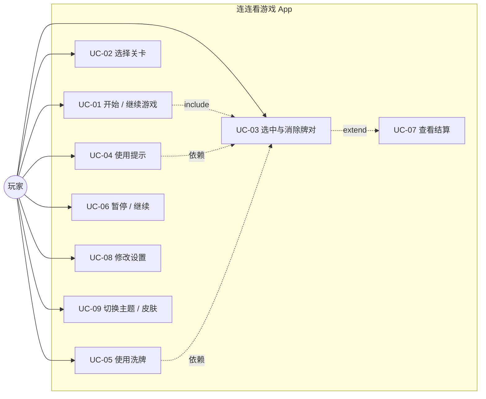
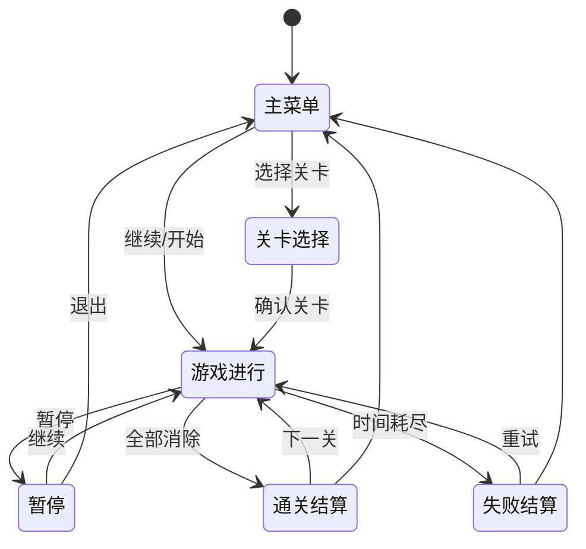

# 软件需求规格说明书（SRS）

## 连连看游戏（Android）

| 项目 | 内容 |
|---|---|
| 文档名称 | 连连看游戏软件需求规格说明书 |
| 文档版本 | V1.4 |
| 编制日期 | 2026-09-11 |
| 项目类型 | 个人作品 / 作品集 |
| 目标平台 | Android（手机竖屏） |
| 文档格式 | Markdown（遵循 IEEE 830 精简版） |
| 状态 | 已评审（基于用户确认的默认方案） |

### 修订历史

| 版本 | 日期 | 修订人 | 说明 |
|---|---|---|---|
| V0.1 | 2026-09-11 | 开发者 | 初始草案与需求澄清 |
| V1.0 | 2026-09-11 | 开发者 | 按确认的默认方案定稿；不包含性能指标 |
| V1.1 | 2026-09-11 | 开发者 | 最低 API 由 26 调整为 **24**；包名确定为 `com.ldxy.lianliankan` |
| V1.2 | 2026-09-12 | 开发者 | 第 4 关棋盘规格由 6×10 调整为 **8×8**，使牌总数随关卡单调不减；UC-03 与 FR-4.4 明确「图案相同但不可连通」时**保留第一张牌的选中态** |
| V1.3 | 2026-09-12 | 开发者 | **撤销 V1.2 关于选中态的规定**：UC-03 与 FR-4.4 改为「图案相同但不可连通」时**清空选中态**（V1.0 真机验收意见）；5.1 游戏主界面顶部增补「当前关卡」 |
| V1.4 | 2026-09-12 | 开发者 | UC-03 与 FR-4.5 同样改为「图案不同」时**清空选中态**（原先为「将第二张牌设为选中」），使两类错误对选中态的处理一致；5.1 补充游戏界面顶部背景需延伸至状态栏区域 |

---

## 1. 引言

### 1.1 编写目的
本文档描述「连连看」Android 游戏的软件需求，作为设计、开发、测试与验收的依据。预期读者为开发者本人、评审者及潜在协作者。

### 1.2 项目背景
连连看是一款经典休闲益智游戏：玩家在棋盘上依次选中两张图案相同、且可用**不超过 2 个拐点**的折线相连的牌，将其消除；在限定时间内消除全部牌即通关。本项目以个人作品/作品集为目标，采用原生 Android 技术栈实现，注重**界面美观**与**游戏手感**。

### 1.3 术语与缩写

| 术语 | 说明 |
|---|---|
| 牌（Tile） | 棋盘上的一个方格单元，承载一个图案 |
| 图案类型（Type） | 牌上的图标种类标识，同类型可配对 |
| 连通 | 两张牌之间存在可行折线路径（拐点数 ≤ 2，绕行允许经过棋盘外部虚拟区域） |
| 拐点（Turn） | 折线路径方向发生改变的点 |
| 死局 | 棋盘上不存在任何一对可连通同类型牌的状态 |
| 洗牌（Shuffle） | 重新排列棋盘上剩余牌的图案 |
| 提示（Hint） | 高亮一对当前可连通的牌 |
| 连击（Combo） | 玩家在限定间隔内连续成功消除所形成的计数 |
| 关卡 | 一局拥有固定棋盘规格、图案种类与限时的完整游戏 |
| MVP | 最小可用版本 |

### 1.4 参考资料
- IEEE Std 830-1998《软件需求规格说明书指南》
- Google Android 官方文档（Jetpack Compose、Material 3、DataStore）
- GD/T 8567 相关章节（参考）

### 1.5 文档约定
- 需求编号规则：功能需求 `FR-x`、非功能需求 `NFR-x`、数据需求 `DR-x`、验收标准 `AC-x`、用例 `UC-xx`。
- 优先级：**P0 = 必须有**，**P1 = 应该有**，**P2 = 可选/后续版本**。
- 所有时间以秒（s）为单位，棋盘尺寸以「列 × 行」表示。

---

## 2. 总体描述

### 2.1 产品愿景与范围
一款**单机、离线、中文**的连连看游戏，面向 Android 手机用户。核心体验为「好看、好点、有手感」：流畅的消除动画、清晰的连线反馈、舒适的 Material 3 视觉。

**范围内（In Scope）**
- 经典闯关模式（多关卡，难度递增）
- 棋盘生成、配对消除、连通判定、死局检测与自动洗牌
- 倒计时、计分与连击
- 提示、洗牌道具
- 音效与振动反馈
- 浅色/深色主题
- 本地进度与设置存储

**范围外（Out of Scope）**
- 联网、账号、云存档、排行榜
- 广告、内购
- 多语言（本版本仅中文）
- 背景音乐（仅音效，不含 BGM）
- 平板/折叠屏专项适配（不禁止运行，但不作为目标）
- 性能指标要求（本版本不纳入）

### 2.2 产品功能概述
1. 主菜单：开始/继续游戏、关卡选择、设置、退出。
2. 关卡选择：展示 10 个关卡及解锁状态与最佳成绩。
3. 游戏进行：棋盘渲染、选中、消除判定、连线动画、计时、计分、连击。
4. 道具：提示、洗牌（每关各有次数上限）。
5. 暂停与结算：暂停/继续/重开/退出；通关或失败结算面板。
6. 设置：音效开关、振动开关、主题模式、皮肤选择、清除进度。
7. 数据：本地保存最高分、已解锁关卡、设置项。

### 2.3 用户特征
- 主要用户：休闲玩家，无需任何游戏经验即可上手。
- 使用场景：碎片时间、单手竖屏操作。
- 技术要求：无。玩家只需具备基本触屏操作能力。

### 2.4 运行环境
- 操作系统：Android 7.0（API 24）及以上。
- 屏幕：手机竖屏（锁定 Portrait）。
- 硬件：支持触屏；扬声器（音效）；振动马达（振动，可选）。
- 网络：**无需网络**。

### 2.5 设计与实现约束
- 开发语言：Kotlin。
- UI 框架：**Jetpack Compose** + **Material 3**。
- 架构：MVVM；UI（Compose）→ ViewModel（StateFlow）→ 领域逻辑（纯 Kotlin）→ 数据（DataStore）。
- 领域逻辑不得依赖 Android SDK，须可在 JVM 上运行单元测试。
- 图案素材：emoji + 矢量图标（Vector Drawable）。
- 包名：`com.ldxy.lianliankan`。

### 2.6 假设与依赖
- 依赖 AndroidX / Compose / DataStore / Kotlin 官方库。
- 假设设备时钟可用且稳定（倒计时基于单调时钟）。
- 假设系统支持振动 API；不支持时静默降级。

### 2.7 需求优先级汇总
- **P0**：棋盘渲染、配对消除、连通判定、计时、结算、进度存储、主菜单。
- **P1**：连击计分、提示、洗牌、音效、振动、主题切换、关卡选择。
- **P2**：皮肤切换、首次启动引导、无障碍优化。

---

## 3. 用例与业务流程

### 3.1 用例图



### 3.2 用例列表

| 编号 | 用例名称 | 参与者 | 简述 | 优先级 |
|---|---|---|---|---|
| UC-01 | 开始/继续游戏 | 玩家 | 从主菜单进入上次进度或新开局 | P0 |
| UC-02 | 选择关卡 | 玩家 | 在已解锁关卡中选择一关开始 | P1 |
| UC-03 | 选中与消除牌对 | 玩家 | 选中两张牌并判定是否可消除 | P0 |
| UC-04 | 使用提示 | 玩家 | 高亮一对可连通的牌 | P1 |
| UC-05 | 使用洗牌 | 玩家 | 重排剩余牌 | P1 |
| UC-06 | 暂停/继续 | 玩家 | 暂停倒计时并弹出菜单 | P0 |
| UC-07 | 查看结算 | 玩家 | 查看通关/失败结果与得分 | P0 |
| UC-08 | 修改设置 | 玩家 | 开关音效/振动、清除进度 | P1 |
| UC-09 | 切换主题/皮肤 | 玩家 | 切换浅色/深色与皮肤 | P1/P2 |

### 3.3 关键用例详细描述

#### UC-03 选中与消除牌对（核心）

| 项 | 内容 |
|---|---|
| 参与者 | 玩家 |
| 前置条件 | 处于游戏进行中，关卡未结束 |
| 触发 | 玩家点击棋盘上的一张牌 |
| 主流程 | 1. 若当前无选中牌 → 将该牌置为「选中」态并高亮。<br>2. 若点击的是已选中牌 → 取消选中。<br>3. 若已有选中牌且点击另一张牌：<br>&nbsp;&nbsp;a. 若两张牌**图案不同** → 视为错误操作，触发错误反馈（两张牌短暂抖动/红闪），**清空选中态**（两张牌均回到未选中），连击计数归零。<br>&nbsp;&nbsp;b. 若图案相同 → 调用连通判定：<br>&nbsp;&nbsp;&nbsp;&nbsp;i. 可连通 → 记录路径，播放连线动画与消除动画，移除两张牌，连击计数 +1 并加分，清理选中态。<br>&nbsp;&nbsp;&nbsp;&nbsp;ii. 不可连通 → 视为错误操作（同 3.a 的反馈，但优化为先给出连通失败提示）；**清空选中态**（第一张与新点击的牌都回到未选中），连击计数归零。<br>4. 每次消除后触发死局检测，若为死局则自动洗牌。 |
| 备选流程 | A1. 消除后棋盘为空 → 触发通关结算（见 UC-07）。<br>A2. 倒计时归零 → 触发失败结算。 |
| 后置条件 | 棋盘状态、分数、连击、计时被更新；状态持久化（进行中进度） |
| 业务规则 | BR-01 拐点数 ≤ 2；BR-02 允许绕棋盘外侧连通；BR-03 路径上不得经过任何未消除的牌 |

#### UC-05 使用洗牌

| 项 | 内容 |
|---|---|
| 前置条件 | 游戏进行中；本关剩余洗牌次数 > 0 |
| 主流程 | 1. 校验剩余次数。<br>2. 取当前棋盘上所有**未消除**的牌，收集其图案类型集合。<br>3. 重新随机分配图案到这些位置，**保证分配后存在至少一对可连通牌**（见 FR-3.4）。<br>4. 清空当前选中态，重置连击计数。<br>5. 剩余次数 −1，更新 UI。 |
| 备选流程 | A1. 次数为 0 → 提示不可用，不执行。 |
| 后置条件 | 棋盘图案重排且可解 |

#### UC-07 查看结算

| 项 | 内容 |
|---|---|
| 前置条件 | 关卡通关或失败 |
| 主流程 | 1. 弹出结算面板，展示：本关得分、连击最高数、剩余时间奖励、是否刷新最佳分。<br>2. 通关：显示「下一关」按钮（若为最后一关则显示「全部通关」）。<br>3. 失败：显示「重试本关」「返回主菜单」按钮。<br>4. 更新并持久化关卡最佳分与解锁进度。 |
| 后置条件 | 进度与成绩已保存 |

### 3.4 游戏状态流程



---

## 4. 功能需求

### 4.1 功能结构

```
连连看游戏
├── 主菜单
│   ├── 开始/继续游戏
│   ├── 关卡选择
│   └── 设置
├── 游戏核心
│   ├── 棋盘生成
│   ├── 选中与消除
│   ├── 连通判定
│   ├── 死局检测与自动洗牌
│   ├── 计时与计分（连击）
│   └── 道具（提示 / 洗牌）
├── 结算与进度
│   ├── 通关 / 失败判定
│   ├── 成绩结算
│   └── 进度解锁与保存
└── 设置与资源
    ├── 音效 / 振动
    ├── 主题 / 皮肤
    └── 本地数据存储
```

### 4.2 功能需求清单

#### FR-1 主菜单与导航
| 编号 | 需求描述 | 优先级 |
|---|---|---|
| FR-1.1 | 应用启动后进入主菜单，展示「开始游戏 / 继续游戏」「关卡选择」「设置」入口 | P0 |
| FR-1.2 | 存在未完成进度时显示「继续游戏」，否则显示「开始游戏」（从第 1 关或首个未通关关卡开始） | P0 |
| FR-1.3 | 提供「退出应用」入口 | P1 |
| FR-1.4 | 界面锁定竖屏 | P0 |

#### FR-2 关卡选择
| 编号 | 需求描述 | 优先级 |
|---|---|---|
| FR-2.1 | 展示全部 10 个关卡，标注解锁状态 | P1 |
| FR-2.2 | 已通关关卡显示其最佳得分 | P1 |
| FR-2.3 | 未解锁关卡不可进入，仅展示锁定态 | P1 |
| FR-2.4 | 通关第 N 关后解锁第 N+1 关 | P1 |

#### FR-3 棋盘生成与可解性
| 编号 | 需求描述 | 优先级 |
|---|---|---|
| FR-3.1 | 按关卡配置生成「列 × 行」棋盘，牌总数与每类图案数量均为**偶数** | P0 |
| FR-3.2 | 生成算法：先构造成对图案集合 → 随机打乱 → 填入棋盘（保证理论可解） | P0 |
| FR-3.3 | 每次生成结果随机（同一关卡不同次生成的布局不同） | P1 |
| FR-3.4 | 洗牌后须保证存在至少一对可连通同类型牌；若随机结果不满足，则重新洗牌（可设置有限次重试后回退到「成对重排」策略） | P0 |
| FR-3.5 | 棋盘四周视为可通行的虚拟空白区（用于绕行连通） | P0 |

#### FR-4 选中与消除
| 编号 | 需求描述 | 优先级 |
|---|---|---|
| FR-4.1 | 点击牌可将其置为选中态并高亮 | P0 |
| FR-4.2 | 再次点击已选中的牌可取消选中 | P0 |
| FR-4.3 | 选中第二张牌时，若与第一张图案相同且可连通，则消除两张牌 | P0 |
| FR-4.4 | 两张牌图案相同但不可连通时，给出「无法连通」反馈，不消除；**清空选中态**（两张牌均回到未选中），使玩家下一次点击从干净状态开始（连击按 FR-8.3 归零） | P0 |
| FR-4.5 | 两张牌图案不同时，视为错误操作，给出错误反馈，并**清空选中态**（两张牌均回到未选中，与 FR-4.4 一致） | P0 |
| FR-4.6 | 消除成功时，在两张牌之间绘制连线（经过拐点）并播放消除动画 | P0 |
| FR-4.7 | 消除过程中禁止重复点击已消除的牌 | P0 |

#### FR-5 连通判定（核心算法）
| 编号 | 需求描述 | 优先级 |
|---|---|---|
| FR-5.1 | 判定两张同类型牌是否存在**拐点数 ≤ 2** 的可行折线路径 | P0 |
| FR-5.2 | 支持 0 拐点（同行或同列，中间无牌阻挡） | P0 |
| FR-5.3 | 支持 1 拐点（L 形，两个候选拐点之一可行即可） | P0 |
| FR-5.4 | 支持 2 拐点（通过两个方向的扫描桥接，实现「Z」/「U」形路径） | P0 |
| FR-5.5 | 允许路径绕行至棋盘外侧虚拟空白区 | P0 |
| FR-5.6 | 判定成功时输出**完整路径点序列**（含拐点坐标），供 UI 绘制 | P0 |
| FR-5.7 | 判定须为纯函数式逻辑，可在 JVM 单元测试中直接调用 | P0 |

#### FR-6 死局检测与自动洗牌
| 编号 | 需求描述 | 优先级 |
|---|---|---|
| FR-6.1 | 每次消除后遍历剩余牌，检测是否存在任意一对可连通同类型牌 | P0 |
| FR-6.2 | 若不存在（死局），自动执行洗牌（**不消耗**玩家洗牌道具次数）并提示「已自动重排」 | P0 |
| FR-6.3 | 自动洗牌后须保证棋盘可解（同 FR-3.4） | P0 |

#### FR-7 计时
| 编号 | 需求描述 | 优先级 |
|---|---|---|
| FR-7.1 | 每关按配置显示倒计时（默认 180s），实时递减 | P0 |
| FR-7.2 | 时间归零判定为失败，暂停结算 | P0 |
| FR-7.3 | 暂停时倒计时停止，继续时恢复 | P0 |
| FR-7.4 | 剩余时间低于 30s 时给予视觉提示（如计时器变红） | P2 |

#### FR-8 计分与连击
| 编号 | 需求描述 | 优先级 |
|---|---|---|
| FR-8.1 | 每成功消除一对获得基础分 10 分（详见附录 9.2 公式） | P0 |
| FR-8.2 | 连续成功消除且在间隔 ≤ 3s 内，形成连击并提升倍率 | P1 |
| FR-8.3 | 错误选中、间隔超时或使用洗牌道具时，连击归零 | P1 |
| FR-8.4 | 通关时按剩余时间发放时间奖励（剩余秒数 × 2 分） | P1 |
| FR-8.5 | 关卡成绩与历史最佳分比较，刷新时给予提示 | P1 |
| FR-8.6 | 计分逻辑位于领域层，可独立单元测试 | P1 |

#### FR-9 道具系统
| 编号 | 需求描述 | 优先级 |
|---|---|---|
| FR-9.1 | 提供「提示」道具：高亮一对当前可连通的牌，每关默认 3 次 | P1 |
| FR-9.2 | 提供「洗牌」道具：重排剩余牌，每关默认 3 次 | P1 |
| FR-9.3 | 道具次数用尽时按钮置灰且不可点击 | P1 |
| FR-9.4 | 使用提示不重置连击；使用洗牌重置连击并清空选中态 | P1 |
| FR-9.5 | 每次开局（含重试）道具次数重置为配置值 | P1 |

#### FR-10 暂停与结算
| 编号 | 需求描述 | 优先级 |
|---|---|---|
| FR-10.1 | 提供暂停按钮，暂停时弹出菜单：继续 / 重开本关 / 返回主菜单 | P0 |
| FR-10.2 | 全部牌消除后判定通关，弹出结算面板 | P0 |
| FR-10.3 | 时间为 0 时判定失败，弹出结算面板 | P0 |
| FR-10.4 | 结算面板展示本关得分、最高连击、时间奖励、最佳分刷新状态 | P1 |
| FR-10.5 | 通关面板提供「下一关」（末关则显示「全部通关」） | P0 |
| FR-10.6 | 失败面板提供「重试本关」「返回主菜单」 | P0 |
| FR-10.7 | 重开/重试不会重置已解锁的关卡进度 | P0 |

#### FR-11 设置
| 编号 | 需求描述 | 优先级 |
|---|---|---|
| FR-11.1 | 音效开关（默认开启） | P1 |
| FR-11.2 | 振动开关（默认开启） | P1 |
| FR-11.3 | 主题模式选择：跟随系统 / 浅色 / 深色（默认跟随系统） | P1 |
| FR-11.4 | 皮肤选择（图案/配色主题），默认 1 套 | P2 |
| FR-11.5 | 「清除进度」操作，需二次确认 | P2 |
| FR-11.6 | 设置项修改后立即生效并持久化 | P1 |

#### FR-12 音效与振动反馈
| 编号 | 需求描述 | 优先级 |
|---|---|---|
| FR-12.1 | 选中、消除、错误、通关、失败各有对应音效 | P1 |
| FR-12.2 | 消除、错误、通关时触发振动反馈（幅度与时长区分） | P1 |
| FR-12.3 | 关闭音效/振动后不再触发对应反馈 | P1 |
| FR-12.4 | **不包含背景音乐（BGM）** | P0(约束) |

#### FR-13 主题与视觉
| 编号 | 需求描述 | 优先级 |
|---|---|---|
| FR-13.1 | 采用 Material 3 设计规范 | P0 |
| FR-13.2 | 支持浅色 / 深色主题切换 | P1 |
| FR-13.3 | 牌面采用圆角卡片 + 阴影，具备点击按压反馈（缩放） | P0 |
| FR-13.4 | 选中态具有明显高亮（边框光晕/背景色） | P0 |
| FR-13.5 | 连线使用 Canvas 绘制，支持渐变/圆角折线 | P0 |
| FR-13.6 | 消除动画：缩放 + 淡出（可含粒子效果） | P1 |
| FR-13.7 | 图案素材使用 emoji 与矢量图标，须保证辨识度 | P0 |
| FR-13.8 | 背景采用渐变或纯色风格，整体配色协调统一 | P1 |

#### FR-14 数据存储
| 编号 | 需求描述 | 优先级 |
|---|---|---|
| FR-14.1 | 使用 DataStore 保存设置项、关卡进度、最佳成绩 | P0 |
| FR-14.2 | 应用重启后设置与进度可恢复 | P0 |
| FR-14.3 | 保存「进行中的关卡」状态，支持「继续游戏」 | P1 |
| FR-14.4 | 数据全部存于本地，不上传任何服务器 | P0 |
| FR-14.5 | 数据结构具备版本号，便于后续升级迁移 | P2 |

---

## 5. 外部接口需求

### 5.1 用户界面（UI）
| 界面 | 主要内容 |
|---|---|
| 主菜单 | 标题、开始/继续、关卡选择、设置、退出 |
| 关卡选择 | 10 关卡片列表，含锁定态与最佳分 |
| 游戏主界面 | 顶部：**当前关卡**、倒计时、当前得分、连击；中部：棋盘；底部：提示、洗牌、暂停。顶部区域的背景色须**向上延伸至状态栏区域**，使状态栏不出现与 HUD 不一致的色带 |
| 暂停弹窗 | 继续 / 重开 / 返回主菜单 |
| 结算弹窗 | 得分、最高连击、时间奖励、下一关/重试/返回 |
| 设置界面 | 音效、振动、主题、皮肤、清除进度 |
| 反馈提示 | Snackbar/Toast 形式：道具用尽、无法连通、自动重排等 |

### 5.2 硬件接口
| 硬件 | 用途 | 说明 |
|---|---|---|
| 触摸屏 | 交互输入 | 单点触控即可 |
| 扬声器 | 音效播放 | 通过 SoundPool 播放短音效 |
| 振动器 | 触觉反馈 | 需 `android.permission.VIBRATE` 权限；不支持时降级 |
| 系统时钟 | 倒计时 | 使用单调时钟，避免受系统时间调整影响 |

### 5.3 软件接口
| 接口 | 用途 |
|---|---|
| Jetpack Compose / Material 3 | UI 渲染与主题 |
| Jetpack ViewModel + StateFlow | 状态管理与 UI 通信 |
| DataStore (Preferences) | 本地持久化 |
| SoundPool / Vibrator | 音效与振动 |
| JUnit | 领域逻辑单元测试 |

### 5.4 通信接口
**无。** 本产品不进行任何网络通信。

---

## 6. 非功能需求

> 说明：按确认结果，**本版本不纳入性能指标要求**（如启动时间、帧率、内存上限等）。

### 6.1 可用性
- NFR-1.1 界面为简体中文，用词通俗。
- NFR-1.2 核心操作（选牌、道具、暂停）在单手握持可达区域内。
- NFR-1.3 关键操作有明确视觉/触觉反馈，避免无响应感。
- NFR-1.4 新用户无需教程即可上手（P2：可提供首次启动简要引导）。

### 6.2 可靠性
- NFR-2.1 连通判定算法须通过单元测试覆盖 0/1/2 拐点及边界场景（含绕外侧、贴边、四角）。
- NFR-2.2 任何时刻棋盘状态都应可解（死局自动重排保证）。
- NFR-2.3 应用异常退出后，已保存进度不丢失。
- NFR-2.4 输入非法/越界坐标时逻辑层应安全忽略，不崩溃。

### 6.3 可维护性
- NFR-3.1 分层清晰：UI / ViewModel / 领域逻辑 / 数据四层，领域层不依赖 Android。
- NFR-3.2 关卡配置、图案集、配色以数据/资源方式定义，避免硬编码。
- NFR-3.3 关键算法具备可读注释与文档（附录 9.1）。

### 6.4 可扩展性
- NFR-4.1 新增关卡仅需修改配置表。
- NFR-4.2 新增图案/皮肤无需改动核心逻辑。
- NFR-4.3 架构预留后续扩展模式（限时/无尽）的可能。

### 6.5 兼容性
- NFR-5.1 支持 Android 7.0（API 24）及以上。
- NFR-5.2 目标设备为手机竖屏；平板可出现布局拉伸，但不要求专门优化。
- NFR-5.3 在深色模式下界面元素对比度可辨。

### 6.6 安全性
- NFR-6.1 不申请敏感权限，仅使用 `VIBRATE`。
- NFR-6.2 不采集、不上传用户个人数据。
- NFR-6.3 无网络访问能力，无第三方数据 SDK。

### 6.7 合规性
- NFR-7.1 若上架，须符合 Google Play 相关政策。
- NFR-7.2 图案素材须为自绘/开源可商用字体或 emoji，避免版权风险。

---

## 7. 数据需求

### 7.1 数据模型（概念）

```
GameState
 ├─ levelConfig: LevelConfig
 ├─ board: Board (rows × cols)
 ├─ score: ScoreState
 ├─ timeLeft: Int
 ├─ hintLeft / shuffleLeft: Int
 └─ phase: enum(READY, PLAYING, PAUSED, WIN, LOSE)

Board
 ├─ rows, cols: Int
 └─ tiles: Array<Array<Tile?>>

Tile
 ├─ id: Int          // 唯一标识
 ├─ type: Int        // 图案类型 0..N-1
 ├─ row, col: Int
 └─ state: enum(NORMAL, SELECTED, HINTED)

LevelConfig
 ├─ level: Int
 ├─ cols, rows: Int
 ├─ typeCount: Int
 ├─ timeLimit: Int
 └─ hintCount / shuffleCount: Int

Settings
 ├─ soundEnabled: Boolean
 ├─ vibrationEnabled: Boolean
 ├─ themeMode: enum(SYSTEM, LIGHT, DARK)
 └─ skinId: Int

Progress
 ├─ maxUnlockedLevel: Int
 ├─ levelBestScore: Map<Int, Int>
 ├─ totalBestScore: Int
 └─ inProgressLevel: Int?   // 用于「继续游戏」
```

### 7.2 数据字典（持久化项 · DataStore）

| 键 | 类型 | 默认值 | 说明 |
|---|---|---|---|
| `sound_enabled` | Boolean | true | 音效开关 |
| `vibration_enabled` | Boolean | true | 振动开关 |
| `theme_mode` | String | "SYSTEM" | SYSTEM/LIGHT/DARK |
| `skin_id` | Int | 0 | 皮肤编号 |
| `max_unlocked_level` | Int | 1 | 已解锁最高关卡 |
| `level_best_score_<n>` | Int | 0 | 第 n 关最佳分 |
| `total_best_score` | Int | 0 | 历史最高总分 |
| `in_progress_level` | Int | 0 | 进行中关卡（0 表示无） |
| `schema_version` | Int | 1 | 数据结构版本 |

### 7.3 存储与持久化策略
- DR-1 使用 DataStore（Preferences）进行键值持久化。
- DR-2 每次关卡结束、进度解锁、设置变更时写入。
- DR-3 进行中关卡采用「一次性快照」保存（棋盘布局 + 分数 + 剩余时间 + 道具次数）；本版本为 P1，若实现成本过高可降级为「仅保存关卡编号」。
- DR-4 所有数据仅存于设备本地，随应用卸载一并清除。

---

## 8. 验收标准

### 8.1 功能验收

| 编号 | 验收项 | 通过标准 | 关联需求 |
|---|---|---|---|
| AC-01 | 棋盘生成 | 每次生成的牌总数为偶数、每类型数量为偶数、布局随机 | FR-3 |
| AC-02 | 0 拐点连通 | 同排/同列相邻或中间为空的同型牌可被消除 | FR-5.2 |
| AC-03 | 1 拐点连通 | L 形路径正确的同型牌可被消除 | FR-5.3 |
| AC-04 | 2 拐点连通 | Z/U 形及绕外侧路径正确的同型牌可被消除 | FR-5.4/5.5 |
| AC-05 | 阻挡判定 | 路径上存在未消除牌时判定为不可连通 | BR-03 |
| AC-06 | 消除反馈 | 消除成功时显示连线与消除动画 | FR-4.6 |
| AC-07 | 错误反馈 | 选错/连不通时给出明确反馈且不误消除 | FR-4.4/4.5 |
| AC-08 | 死局处理 | 无解时自动重排并提示，且重排后可解 | FR-6 |
| AC-09 | 计时 | 倒计时正常递减，归零触发失败；暂停时停止 | FR-7 |
| AC-10 | 计分与连击 | 得分与连击按附录公式正确计算 | FR-8 |
| AC-11 | 道具 | 提示/洗牌按次数使用，用尽后不可再点 | FR-9 |
| AC-12 | 通关 / 失败 | 全部消除判胜、超时判负，结算面板正确 | FR-10 |
| AC-13 | 关卡解锁与进度 | 通关解锁下一关，重启后进度保留 | FR-2/FR-14 |
| AC-14 | 设置持久化 | 音效/振动/主题修改后立即生效且重启保留 | FR-11/FR-14 |
| AC-15 | 主题 | 浅色/深色切换正常，深色下元素清晰可辨 | FR-13.2 |
| AC-16 | 离线 | 断网状态下功能完全可用 | NFR-6 |
| AC-17 | 算法单测 | 连通判定核心用例单测全部通过 | NFR-2.1 |

### 8.2 非功能验收
| 编号 | 验收项 | 通过标准 |
|---|---|---|
| AC-18 | 兼容性 | 在 API 24 及以上的手机竖屏设备上可正常启动与游戏 |
| AC-19 | 稳定性 | 连续游玩 10 分钟无崩溃、无卡死 |
| AC-20 | 权限 | 仅申请 VIBRATE 权限，无网络权限 |

### 8.3 验收方式
- **单元测试**：连通判定、棋盘生成、洗牌可解性、计分逻辑（JVM 测试）。
- **手动测试**：按 8.1 逐项操作验证。
- **回归测试**：每次发版前重跑核心用例 AC-01 ~ AC-13。

---

## 9. 附录

### 9.1 连通判定算法说明
- 将棋盘扩展一圈虚拟空白（`(rows+2) × (cols+2)`），使绕行路径统一处理。
- **0 拐点**：A、B 同行或同列，且其间所有格均为空。
- **1 拐点**：对两个候选拐点 `(A.row, B.col)` 与 `(B.row, A.col)`，检查「A→拐点」与「拐点→B」两条线段是否均畅通。
- **2 拐点**：沿 A 的行/列方向逐格扫描，对每个可直达的空白点 P，检查 P 与 B 是否满足 0 或 1 拐点条件（等价于寻找一个中间桥接段）。找到即返回完整路径点序列。
- 复杂度对 8×12 规模可忽略，实时判定无压力。

### 9.2 计分公式
```
单次消除得分 = 基础分(10) × 连击倍率
连击倍率     = min(1 + 0.1 × (连击数 - 1), 2.0)
连击判定     = 连续成功消除，且相邻两次间隔 ≤ 3 秒
连击重置     = 错误选中 / 间隔 > 3 秒 / 使用洗牌道具
关卡总分     = Σ(单次消除得分) + 剩余时间(s) × 2
总成绩       = 各关卡总分之和（用于总榜展示）
```

### 9.3 关卡难度配置表（建议值，可调）

| 关卡 | 棋盘(列×行) | 牌总数 | 图案种类 | 限时(s) | 提示 | 洗牌 |
|---|---|---|---|---|---|---|
| 1 | 6×8 | 48 | 8 | 180 | 3 | 3 |
| 2 | 6×8 | 48 | 9 | 180 | 3 | 3 |
| 3 | 8×8 | 64 | 9 | 180 | 3 | 3 |
| 4 | 8×8 | 64 | 10 | 180 | 3 | 3 |
| 5 | 8×8 | 64 | 10 | 175 | 3 | 3 |
| 6 | 8×10 | 80 | 10 | 170 | 3 | 3 |
| 7 | 8×10 | 80 | 11 | 165 | 3 | 3 |
| 8 | 8×10 | 80 | 12 | 160 | 3 | 3 |
| 9 | 8×12 | 96 | 12 | 155 | 2 | 2 |
| 10 | 8×12 | 96 | 13 | 150 | 2 | 2 |

> 注：规格选用「宽度 × 高度」；所有尺寸的乘积均为偶数，且每类图案分配偶数张牌，保证可完全消除。
>
> 版本 V1.2 起，棋盘规格按「每 2–3 关共用一档」递增（6×8 → 8×8 → 8×10 → 8×12），
> 因此牌总数序列为 48, 48, 64, 64, 64, 80, 80, 80, 96, 96，**随关卡单调不减**；
> 图案种类 8→13 单调不减，限时 180→150 单调不增。
> 第 4 关原为 6×10（60 张），会使其牌总数低于第 3 关（64 张），已在 V1.2 修正为 8×8。

### 9.4 本版采用的取值假设（供确认）
以下取值在需求澄清时未逐项确认，采用合理默认值，后续可调整：
1. 总关卡数为 **10**；
2. 难度递增方式 = 棋盘变大 + 图案种类变多 + 限时略减；
3. 每关道具默认为 **3 次**（后两关为 2 次）；
4. 连击判定间隔为 **3 秒**、倍率上限 **2.0**；
5. 应用包名使用 `com.ldxy.lianliankan`；最低支持 **API 24（Android 7.0）**。

### 9.5 未来版本（Backlog）
- 限时模式 / 无尽模式 / 挑战模式
- 成就系统、每日挑战
- 中英双语
- 平板与折叠屏适配
- 背景音乐与音量控制
- 性能指标定义与优化专项
